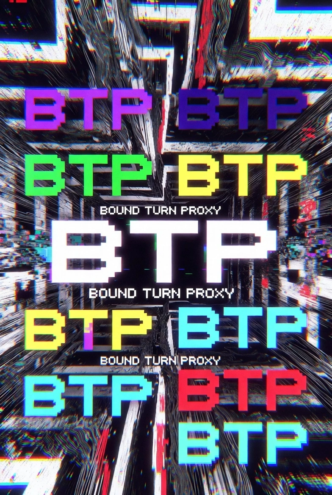

<div align="center">




</div>

## О проекте

**btp** — туннель UDP/TCP через TURN-реле VK Calls. Клиент берёт временные TURN-учётки из ссылки на звонок и гонит ваш трафик (WireGuard, Xray/VLESS) до сервера на VPS поверх DTLS.

## Разработка

### Зависимости

- **Go** ≥ 1.25 — `https://go.dev/dl/`
- **Task** (runner) — `go install github.com/go-task/task/v3/cmd/task@v3.40.0` или `winget install Task.Task` / `brew install go-task`

Остальные dev-инструменты (`golangci-lint`, `govulncheck`, `goimports`, `goreleaser`) ставит сам Task:

```bash
task tools:install
```

### Команды

```bash
task                # список доступных задач
task build          # собрать client + server в dist/ для текущего хоста
task build:all      # кросс-сборка всех target через goreleaser snapshot
task test           # go test -race
task test:cover     # тесты + покрытие → cover.html
task lint           # golangci-lint
task fmt            # gofmt + goimports (форматирование)
task fmt:check      # проверить форматирование (используется в CI)
task vet            # go vet
task vuln           # govulncheck
task ci             # полный набор: fmt:check + vet + lint + test + vuln
task tidy           # go mod tidy
task clean          # удалить dist/, cover.out, cover.html
```

## Документация

- [Быстрый старт (WireGuard)](./docs/quickstart.md)
- [Режимы: UDP / TCP / OBF / KCP](./docs/modes.md)
- [Флаги клиента и сервера](./docs/flags.md)
- [Развёртывание: systemd, Docker](./docs/deploy.md)
- [Мобильные: Android (Termux), iOS (iSH)](./docs/mobile.md)
- [Решение проблем](./docs/troubleshooting.md)

---

<div align="center">

Telegram канал: [Free Turn](https://t.me/+5BdkU4q_CGQyNTdi)

</div>
